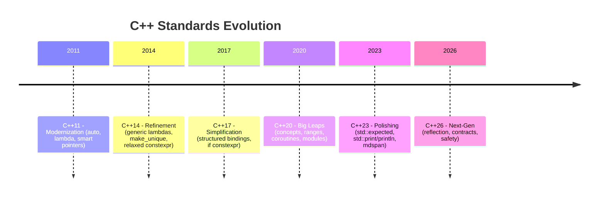

# Modern C++ - Top 5 of each version
Modern C++ evolution (C++11 onward) has been driven by **developer demand for safer, more expressive, and less verbose code**. Each new standard extended that trend: 




What are the top 5 favorite features in each version?

---

## C++11 (2011)

1. **`auto` type deduction** – *Purpose:* Remove repetitive type annotations. Developers love that `auto` “tracks” the right type if the initializer changes, reducing visual clutter. 
 ```cpp
 auto x = 42; // x is int
 auto vec = std::vector<double>{1.1, 2.2};
 ``` 
 *Use-case:* Ideal when the exact type is obvious or long (like iterators or lambdas), making code easier to write and maintain (trade-off: hides type, so readability relies on initializer clarity).

2. **Move semantics** (`std::move`) – *Purpose:* Eliminate unnecessary copies for performance. `std::move` turns copies into moves, enabling efficient transfer of resources. 
 ```cpp
 std::string a = "hello";
 std::string b = std::move(a); // b takes ownership; a becomes empty
 ``` 
 *Use-case:* Critical in high-performance code (STL containers, large objects) to avoid deep copies; requires care (using moved-from objects).

3. **Lambda functions** – *Purpose:* Write inline, anonymous function objects concisely. Lambdas improve code clarity by placing the function logic at the call site. 
 ```cpp
 auto add = [](int x, int y) { return x + y; };
 std::cout << add(3, 4); // outputs 7
 ``` 
 *Use-case:* Great for callbacks, custom sorting, or any small function. By capturing context, they reduce boilerplate of separate functor classes (trade-off: may complicate debugging if overused).

4. **`std::unique_ptr` (and `std::shared_ptr`)** – *Purpose:* Modern smart pointers for automatic memory management. `unique_ptr` (introduced in C++11) makes ownership explicit and RAII-based, preventing leaks. 
 ```cpp
 auto p = std::make_unique<MyClass>(10); // allocate MyClass(10)
 ``` 
 *Use-case:* Use instead of raw `new`; essential in modern C++ projects (e.g. resource management, container elements). Slight overhead for `shared_ptr`, but `unique_ptr` is zero-cost.

5. **Range-based for loops** – *Purpose:* Simple iteration syntax for containers/arrays. More readable than index/pointer loops and less error-prone. 
 ```cpp
 std::vector<int> v = {1,2,3};
 for (int x : v) {
 std::cout << x << "\n"; // prints 1 2 3
 }
 ``` 
 *Use-case:* Preferred for iterating over any STL container or array; avoid manual iterator code. (Trade-off: cannot modify container size during iteration.)

---

## C++14 (2014)

1. **Generic lambdas** (`auto` parameters) – *Purpose:* Let a lambda deduce parameter types automatically, making lambdas templated. One lambda can handle multiple types. 
 ```cpp
 auto f = [](auto a, auto b) { return a + b; };
 std::cout << f(2, 3) << f(2.5, 4.5); // outputs 5 and 7
 ``` 
 *Use-case:* Useful for writing reusable callbacks (e.g. `std::sort`) without hand-writing templates. Eliminates boilerplate lambda templates.

2. **`std::make_unique`** – *Purpose:* Factory function for `unique_ptr` (missing in C++11). It simplifies pointer creation and is exception-safe. 
 ```cpp
 std::unique_ptr<Foo> ptr = std::make_unique<Foo>(arg);
 ``` 
 *Use-case:* Always prefer `make_unique` over `new`; it’s safer (no manual `delete` and handles exceptions).

3. **Return-type deduction (`auto` function return)** – *Purpose:* Functions can omit the return type (use `auto`) and let the compiler deduce it from the return expression. 
 ```cpp
 auto sum(int a, int b) { return a + b; } // deduces return type int
 ``` 
 *Use-case:* Shortens template code and member functions in classes without specifying return, at expense of less explicit function signatures.

4. **Relaxed `constexpr`** – *Purpose:* More code allowed in `constexpr` functions (loops, local vars, branching), enabling complex compile-time computation. 
 ```cpp
 constexpr int factorial(int n) {
 int r = 1;
 for (int i = 1; i <= n; ++i) r *= i;
 return r;
 }
 constexpr int f6 = factorial(6); // computed at compile-time
 ``` 
 *Use-case:* Useful in performance-critical code to compute values at compile time (e.g. lookup tables). Requires `constexpr` context to trigger.

5. **`decltype(auto)` return** – *Purpose:* Deduce return type exactly as the returned expression (including references). It preserves const/ref qualifiers automatically. 
 ```cpp
 std::string& get1();
 std::string get2();
 decltype(auto) wrapper1() { return get1(); } // returns std::string&
 decltype(auto) wrapper2() { return get2(); } // returns std::string
 ``` 
 *Use-case:* Handy for perfectly forwarding return of auto members in generic code; maintain reference-ness correctly (trade-off: can be subtle if misused).

---

## C++17 (2017)

1. **Structured bindings** (`auto [a,b] = …`) – *Purpose:* Unpack tuples, pairs, or structs into separate variables by name. Improves readability by eliminating manual `get<>()` or `.first/.second`. 
 ```cpp
 std::pair<int,std::string> p{42,"hello"};
 auto [num, text] = p; // num=42, text="hello"
 ``` 
 *Use-case:* Commonly used to unpack `map` entries or function-returned tuples. (Trade-off: structured bindings make copies unless using `auto&`.)

2. **`if constexpr`** – *Purpose:* Compile-time conditional. Compiler only instantiates the branch whose condition is true, removing the need for SFINAE tricks. 
 ```cpp
 template<typename T>
 void foo(T t) {
 if constexpr(std::is_integral_v<T>)
 std::cout << "Integral\n";
 else
 std::cout << "Non-integral\n";
 }
 ``` 
 *Use-case:* Simplifies template metaprogramming (e.g. enabling/disabling code paths). Over `#if` or `enable_if`, it produces clearer code.

3. **`std::optional`** – *Purpose:* Represents “maybe” a value (either containing a value or nullopt). It replaces ad-hoc null flags or sentinel values with a clear type. 
 ```cpp
 std::optional<int> divide(int a, int b) {
 if (b == 0) return std::nullopt;
 return a/b;
 }
 ``` 
 *Use-case:* Common in functions that may fail; forces callers to check, improving safety (trade-off: slight overhead vs raw pointers).

4. **`std::string_view`** – *Purpose:* Non-owning, read-only view of a string. It allows zero-copy passing of substrings/literals with minimal overhead. 
 ```cpp
 void print_sv(std::string_view sv) {
 std::cout << sv;
 }
 print_sv("hello"); // no allocation, efficient
 ``` 
 *Use-case:* Used in performance-sensitive code (parsing, logging) to avoid copying strings. Must ensure original string outlives the view.

5. **`std::variant`** – *Purpose:* Safe union type (holds one of several types). Ideal for functions or APIs with different return types or for a tagged union pattern (like Boost.Variant). 
 ```cpp
 std::variant<int, std::string> v;
 v = 10;
 v = "ten"; // now holds string
 ``` 
 *Use-case:* Useful in interpreters, serializers, or any code requiring polymorphic value containers. Requires visitor pattern to extract, which is the main complexity.

---

## C++20 (2020)

1. **Concepts** – *Purpose:* Clearly specify template requirements with named constraints (e.g. `std::integral`). They provide human-readable error messages and early checks, greatly improving template usability. 
 ```cpp
 template<std::integral T>
 T add(T a, T b) { return a+b; }
 ``` 
 *Use-case:* Widely used to constrain generic code (e.g. numeric algorithms). Makes templates self-documenting. (Trade-off: compiler support maturation required, but now generally available.)

2. **Ranges Library** – *Purpose:* Provides lazy range views and actions (in `<ranges>`). Enables pipelined STL algorithms and filters (functional style) without extra loops. 
 ```cpp
 #include <ranges>
 auto v = std::vector{1,2,3,4,5};
 for (int x : v | std::views::filter([](int i){ return i%2==0; }))
 std::cout << x; // prints 2 4
 ``` 
 *Use-case:* Makes complex data processing concise (filter/map pipelines). (Trade-off: a learning curve, and potential hidden cost if misuse laziness.)

3. **Coroutines** (`co_await`) – *Purpose:* Language-level support for lazy/asynchronous functions. Coroutines let you write async code (or iterators) as if it were linear, hiding the state machine. 
 ```cpp
 std::generator<int> gen() {
 for(int i=1;;++i) co_yield i; // infinite generator
 }
 ``` 
 *Use-case:* Useful for async I/O, event loops, and generators. (Trade-off: complexity of promises/schedulers; debugging stacks can be non-obvious.)

4. **Modules** – *Purpose:* A new modular import system to replace textual headers. Promises faster builds (no redundant parsing) and better encapsulation. 
 ```cpp
 // In foo.cppm (module interface)
 export int add(int a, int b) { return a+b; }
 // In main.cpp
 import :foo;
 std::cout << add(2,3);
 ``` 
 *Use-case:* Adopted in large codebases to reduce build times. (Trade-off: requires toolchain support; migration from headers can be complex.)

5. **`std::format`** – *Purpose:* Safe, extensible text formatting (like Python’s format or fmt library). It simplifies formatted output with `{}` placeholders. 
 ```cpp
 std::cout << std::format("Hello {}!", "world");
 ``` 
 *Use-case:* Printing and logging become clearer. Many developers use `{fmt}` library similarly; having it in the standard removes an external dependency.

---

## C++23 (2023)

1. **`std::expected`** – *Purpose:* Standardized the “expected or error” monad. `std::expected<T,E>` holds either a `T` or an error `E`, enabling error propagation without exceptions. 
 ```cpp
 std::expected<int,std::string> read_number(bool ok) {
 if (!ok) return std::unexpected("Read failed");
 return 42;
 }
 ``` 
 *Use-case:* Common in parsing or embedded code where throwing is undesirable. Forces explicit error handling. (Note: must check for error or use `unexpect`; mixing with exceptions can be tricky.)

2. **`std::print`/`std::println`** – *Purpose:* Built-in C++20-style printing using `printf`-like format specifiers or `{}` syntax. Simplifies console output with type safety. 
 ```cpp
 std::print("Hello, {}!\n", "world");
 ``` 
 *Use-case:* Makes I/O concise (replacing cumbersome `<iostream>` syntax). Many devs welcome it as it parallels `fmt::print`. (Trade-off: unlike `fmt`, standard version is frozen; but portable.)

3. **`std::mdspan`** (multi-dimensional array view) – *Purpose:* Provides a view (non-owning) of multi-dimensional arrays/matrices, with native support for `operator[]` taking multiple indices. 
 ```cpp
 double arr[3][3] = { /*...*/ };
 std::mdspan<double, std::extents<3,3>> m(arr);
 double x = m[1][2]; // 2D indexing
 ``` 
 *Use-case:* Crucial for numeric and scientific computing where multi-dimensional data is common. (Helps avoid nested loops with manual indexing, minimal overhead.)

4. **Deducing `this` (explicit object parameters)** – *Purpose:* Allows writing member functions that deduce the type of the object (`auto this`), enabling generic code inside classes. 
 ```cpp
 struct S {
 void print(this auto& self) {
 std::cout << typeid(self).name() << "\n";
 }
 };
 ``` 
 *Use-case:* Useful for library authors writing CRTP or for generic `this` usage. (Minor feature, good for reducing `&` qualifiers, some see it as niche.)

5. **`if consteval`** – *Purpose:* A new keyword for compile-time-only branches. Useful when a function needs different code paths at compile-time vs run-time. 
 ```cpp
 int foo(int n) {
 if consteval {
 return 1; // only at compile time
 } else {
 return n * n;
 }
 }
 ``` 
 *Use-case:* Ensures certain operations only happen during constant evaluation (e.g. static initializations). (Not widely used yet, but adds precision to `constexpr` logic.)

---

## C++26 (2026, anticipated)

1. **Compile-time Reflection** – *Purpose:* Fully introspect program structure (`class`, `functions`, etc.) at compile time (using `reflexpr` operator). Long-awaited (proposed since ~2008). *Community enthusiasm:* **High** (“the community has been writing proposals about [reflection] since 2008”). 
 *Use-case:* Enables generation of boilerplate (e.g. serialization, interface definitions) and powerful metaprogramming without external tools. Expected to fundamentally change how generic code is written.

2. **Memory-safety defaults** – *Purpose:* Make undefined behaviors safer by default (e.g. uninitialized variables now have indeterminate or zero value, container accesses checked). Aims to catch bugs (bounds, uninit) at runtime or compile-time. *Community enthusiasm:* **High** (already deployed in production at Google, claimed to prevent thousands of bugs). 
 *Use-case:* Improves safety for all C++ codebases without rewriting (just recompile). May incur slight performance/runtime overhead in debug modes.

3. **Contracts** (`pre`/`post`, `contract_assert`) – *Purpose:* Built-in language support for function contracts (preconditions/postconditions). Adds explicit annotations for assertions. *Community enthusiasm:* **Medium** (widely desired by some, but debated on performance/runtime cost). 
 *Use-case:* Facilitates defensive programming (e.g. `int f(int x) pre(x>0) post(result>0) { ... }`). If widely adopted, can catch logical errors early in development.

4. **Unified Concurrency/Executors** – *Purpose:* Standard async/task framework (executors, unified API for threads and parallel algorithms). Builds a common foundation for concurrency. *Community enthusiasm:* **Medium** (needed, but adoption depends on implementation support). 
 *Use-case:* Makes it easier to write portable parallel code (e.g. offload tasks to thread pools or GPUs with a standard API).

5. **(Other notes)**: C++26 also includes many `constexpr` enhancements (virtual calls, exceptions in `constexpr`, etc.) and library additions (e.g. `<stacktrace>` was introduced in C++23). These improve compile-time flexibility and debugging. Enthusiasm is generally **high** for compile-time features and static analysis improvements.

---

# Summary Table of Top Features

| Standard | Top Feature | Why Loved (Developer View) |
|----------|-----------------------|------------------------------------------------|
| **C++11** | auto type deduction | Concise code, type safety (auto-tracks type) |
| | Move semantics | Performance (enables `std::move`, no unnecessary copies) |
| | Lambdas | In-place callbacks (improves clarity, less boilerplate) |
| | `std::unique_ptr` | RAII memory management (avoids manual delete) |
| | Range-based for | Easier iteration (cleaner `for` over containers) |
| **C++14** | Generic lambdas | Polymorphic lambdas (auto parameters) |
| | `std::make_unique` | Safer pointer creation, exception-safe new |
| | auto return type | Function return type deduction (brevity) |
| | Relaxed `constexpr` | More compile-time code (loops, branches) |
| | `decltype(auto)` | Exact return-type forwarding (incl. references) |
| **C++17** | Structured bindings | Unpack tuples/structs succinctly |
| | `if constexpr` | Compile-time branching in templates |
| | `std::optional` | Explicit “maybe” values (no nulls) |
| | `std::string_view` | Zero-copy string handling (views, substrings) |
| | `std::variant` | Type-safe union (flexible data type) |
| **C++20** | Concepts | Constrained templates (readability, early errors) |
| | Ranges | Composable algorithms (views + pipelines) |
| | Coroutines | Async/generator support (simpler async code) |
| | Modules | Faster builds & encapsulation (modernize includes) |
| | `std::format` | Modern formatting (replacement for printf/iostream) |
| **C++23** | `std::expected` | Explicit error-return (monadic error handling) |
| | `std::print/println` | Convenient formatted I/O in core (like fmt) |
| | `std::mdspan` | Native multi-D array views (n-dim indexing) |
| | Deducing `this` | Generic member functions (auto `this`) |
| | `if consteval` | Compile-time-only branch (refines constexpr) |
| **C++26** *(anticipated)* | Reflection | Introspection at compile-time (metaprogramming) |
| | Memory safety | Bounds checks & init defaults (safer code) |
| | Contracts | Built-in pre/post conditions (assertions) |
| | Concurrency (Executors) | Standard async/executors (tasks API) |
| | ... | (Others like constexpr virtual, improved libraries) |


