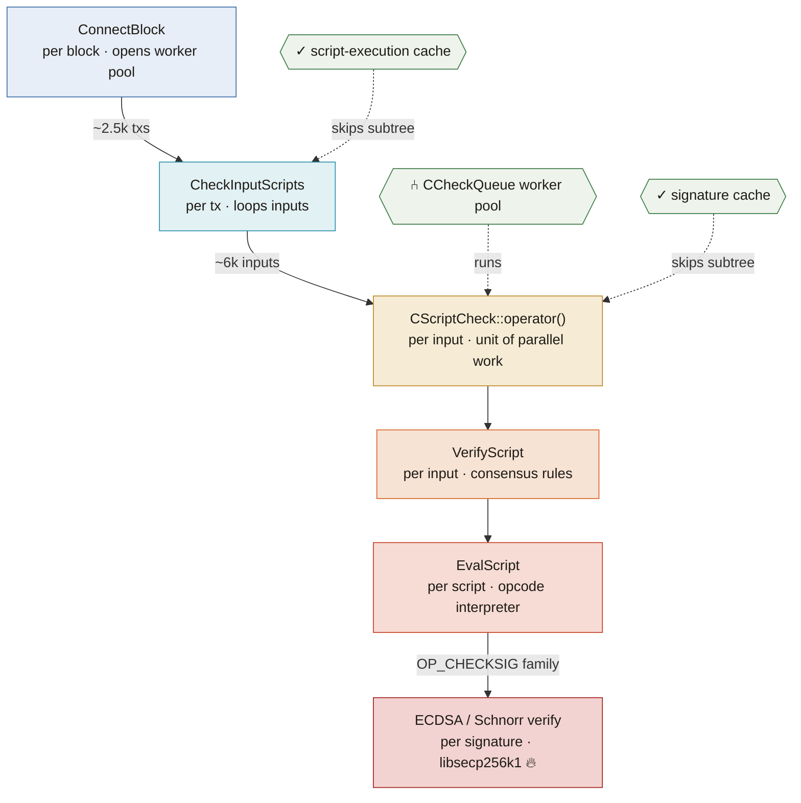

# Low Latency Patterns in Bitcoin Core


Bitcoin Core is the dominant full-node implementation of the Bitcoin network (at least 80% of the nodes run this implementation). 

There are somewhere between 15000 and 100000 of those nodes, scattered around the globe (Source: [bitref.com](https://bitref.com/nodes/)). Most of them just receive, validate and relay transactions. A few of them build new blocks and broadcast them. The whole logic is coded in good old C++ and is actively maintained. Core produces about two major releases per year, with additional maintenance releases. 

Can Bitcoin Core be considered a low-latency system?

Although its latency budget is measured in milliseconds to seconds (not nanoseconds as in HFT and electronic trading) and although it never touches the most extreme parts of the low-latency toolkit (kernel-bypass networking, cache-line padding against false sharing), it still has a number of **hot paths**: 
- block and transaction validation, 
- signature checking, 
- the UTXO cache and 
- the P2P message loop 

They all face some of the pressures a trading engine faces: 

*don't allocate on the heap, stay in cache, don't take locks.*

The objective of this doc is to give an overview of low latency patterns (or at least a subset of them) through concrete examples in a large, heavily reviewed, production codebase that has been running uninterrupted for 17 years.

---

## 1. What is low-latency programming?

Low-latency programming optimizes for **how long a single operation takes** (latency) not how many operations you can do per second (throughput). Those two goals often pull in opposite directions, and the discipline is largely about knowing when you are optimizing for which.

Three properties matter:

**Speed (raw latency).** The wall-clock time from input to result. This is the obvious axis, and it's what people usually mean, but on its own it's the least important of the three for a system that has to be *dependable*.

**Jitter (tail latency).** The variance in latency, not its average. A path that takes 1&nbsp;µs on average but occasionally spikes to 500&nbsp;µs is often worse than one that reliably takes 5&nbsp;µs, because the spikes are what lose the race, blow the deadline, or overflow a buffer. Practitioners care about the *distribution* (p99, p99.9) and the worst case far more than the *mean*. Most low-latency engineering is really *jitter* engineering.

**Predictability (determinism).** The absence of operations whose cost you cannot predict: heap allocation (which can walk free-lists, take a global lock, or trigger a system call), page faults, TLB misses, cache misses (L1, L2, L3), lock contention, and system calls that cross into the kernel. Removing these sources of non-determinism is what flattens the tail. Almost every pattern in Section 3 is a way to make execution cost *knowable in advance*.

### When is it necessary? Only in the hot path.

Low-latency techniques are used only when needed. A program has a *hot path* (the code that runs on every message, every input, every iteration of the inner loop) and a *cold path* (startup, configuration, error handling, teardown, admin RPCs). Optimizing the cold path buys nothing and costs readability. Optimizing the hot path is where all the effort goes.

This is exactly how Core is written. The `PoolAllocator` behind the UTXO map, the `prevector` behind every script, the relaxed atomics in the signature cache: they live on the paths that run millions of times during a sync. The rest of the codebase reads like ordinary modern C++. Indeed the first question for any latency-sensitive work should be "**is this even on the hot path?**"

---

## 2. Where are the hot paths in Bitcoin Core?

Core has two dominant workloads with quite different properties: **IBD** and **relay**. 

Almost all of its optimization pressure historically came from the first:

**Initial Block Download (IBD) / block validation**

priority: **throughput** 

Anyone who has attempted to build a node for the first time knows the pain: the initial sync can take days. Making this faster is crucial for adoption. If it takes weeks to build a node then people simply give up (you are not rewarded for running a node unless you mine).

When a node syncs, it validates the entire chain as fast as the hardware allows. This is where the pool allocator (`PoolAllocator`), the parallel check queue (`CCheckQueue`) and the caches prove to be useful. The IBD call chain is:




For more info about what happens during Initial Block Download and block validation, look-up Andreas' classic [Mastering Bitcoin](https://github.com/bitcoinbook/bitcoinbook/blob/develop/BOOK.md). 

The most CPU-intensive hot paths, in rough order:

1. **Script & signature verification**:
illustrated in the diagram above. [`ConnectBlock`](https://github.com/bitcoin/bitcoin/blob/v30.2/src/validation.cpp#L2378) builds a [`CScriptCheck`](https://github.com/bitcoin/bitcoin/blob/v30.2/src/validation.cpp#L2097) per input; each runs the opcode interpreter [`EvalScript`](https://github.com/bitcoin/bitcoin/blob/v30.2/src/script/interpreter.cpp#L406) and, for the `OP_CHECKSIG` family, drops into elliptic-curve verification. This one path is parallelized across a **worker pool** (the check queue) and supported by two **caches** (signature cache + script-execution cache).
2. **UTXO set access**: [`CCoinsViewCache::FetchCoin`](https://github.com/bitcoin/bitcoin/blob/v30.2/src/coins.cpp#L48) and friends. Every spent input may require a lookup through the UTXO view hierarchy. Frequently accessed or modified entries reside in `CCoinsViewCache`, while cache misses can reach the backing chainstate database. Performance therefore depends on the configured database cache, workload locality and storage subsystem.
3. **Hashing**: double-SHA256 for txids, wtxids, merkle roots, block hashes, and the checksum on every network message; SipHash for hash-map salting. Compute-bound and pervasive.
4. **Merkle root**: pairs of hashes reduced a whole level at a time to keep SIMD lanes full.
5. **Serialization / deserialization**: every block, transaction, and P2P message flows through the compile-time serialization machinery; during IBD you deserialize blocks as fast as you can read them.

**Steady-state relay / propagation**

priority: **latency** 

A running node spends most of its time relaying transactions and *racing to propagate blocks*. Two hot paths here: **mempool acceptance** (fee-rate ordering, ancestor/descendant tracking, RBF, package validation) and **P2P message handling / compact-block reconstruction**.

The block-propagation path is the closest thing Core has to a genuinely latency-critical, tick-to-trade-style path: a miner that loses the propagation race loses money, so validating-and-forwarding a new block quickly has a real economic edge. The difference from a trading desk is only the clock — Core's "tick" is a block roughly every ten minutes, not a quote every microsecond. Same instincts, different timescale.

---

## 3. Low-latency patterns, with examples in Bitcoin Core

The patterns group into four families. Each entry gives the technique, the concrete Core example(s), and the trading-systems analogue.

### Summary index

| Pattern | Bitcoin Core example | Trading analogue |
|---|---|---|
| Arena / pool allocation | `PoolResource` behind `CCoinsMap` | `pmr` / object pools for order-book maps |
| Small-buffer optimization | `prevector` → `CScriptBase` | `small_vector`, inline buffers |
| Alignment control | `alignas(char*)` in `prevector` | `alignas` for aligned loads / cache lines |
| `reserve()` up front | `txmempool` batch buffers | pre-sizing to kill mid-loop reallocation |
| Pinned / secure memory | `LockedPool` (`mlock`) | huge-pages, pinned NIC buffers |
| Lock-free / relaxed atomics | signature-cache bit array, ID counters, CAS loops | lock-free queues/counters |
| Memory-ordering discipline | `relaxed` vs `acquire`/`release` (`CThreadInterrupt`) | publishing writes across threads correctly |
| Batching | `CCheckQueue` batches of checks | amortizing dispatch/sync overhead |
| Runtime ISA dispatch | `SHA256AutoDetect` function pointer | SIMD kernels + function multiversioning |
| Branch hints | `[[unlikely]]` on rare paths | `[[likely]]`/`__builtin_expect` on tick branches |
| Compile-time / zero-cost | `if constexpr`, `consteval`, `<bit>` | template metaprogramming, `constexpr` |

---

### A. Memory & allocation

Bounding allocation cost is the highest-value lever in both worlds, because `malloc` is the classic source of unbounded jitter.

**A1. Custom memory pools / arena allocation.** The most HFT-flavored pattern in the codebase. Rather than hitting `malloc` on every insert, the UTXO cache allocates map nodes from a slab/free-list pool. The "pre-allocate an arena, hand out fixed-size blocks" trick is used to keep hot maps off the global heap. [`PoolResource`](https://github.com/bitcoin/bitcoin/blob/v30.2/src/support/allocators/pool.h#L72) is described in-source as similar to `std::pmr::unsynchronized_pool_resource`, holding uniform-size blocks in a free-list, and it is wired into the hottest structure in consensus: [`CCoinsMap`](https://github.com/bitcoin/bitcoin/blob/v30.2/src/coins.h#L224) is a `std::unordered_map<COutPoint, CCoinsCacheEntry, …, PoolAllocator<…>>` — every node comes from the pool, not `new`.
*Trading analogue:* custom allocators / `pmr` / object pools to bound allocation latency and cut fragmentation.

**A2. Small-buffer optimization.** `prevector` stores short sequences inline and only spills to the heap when it outgrows `N` — the same SBO idea behind `boost::small_vector` and fixed-capacity containers. The [`union direct_or_indirect`](https://github.com/bitcoin/bitcoin/blob/v30.2/src/prevector.h#L116) overlays the inline array with the heap pointer, and [`is_direct()`](https://github.com/bitcoin/bitcoin/blob/v30.2/src/prevector.h#L134) is the one-comparison branch that picks between them. It is used for the most numerous small object in the system: [`CScriptBase = prevector<36, uint8_t>`](https://github.com/bitcoin/bitcoin/blob/v30.2/src/script/script.h#L407), sized so the overwhelming majority of scripts never allocate.
*Trading analogue:* `small_vector` / inline buffers to keep short-lived data off the allocator.

**A3. Alignment control.** [`alignas(char*) direct_or_indirect _union`](https://github.com/bitcoin/bitcoin/blob/v30.2/src/prevector.h#L124) forces the inline union to pointer alignment, so the "indirect" branch is a plain aligned pointer load rather than a potential misaligned access.
*Trading analogue:* `alignas` for aligned loads and deliberate cache-line placement.

**A4. Allocation avoidance via `reserve()`.** Sizing a container once, up front, eliminates the reallocate-and-copy churn that would otherwise happen mid-loop. The mempool does this repeatedly, e.g. [`iters.reserve(mapTx.size())`](https://github.com/bitcoin/bitcoin/blob/v30.2/src/txmempool.cpp#L837), as do the batch buffers in net processing.
*Trading analogue:* pre-sizing ring/scratch buffers so the steady state never reallocates.

**A5. Pinned / secure memory pool (adjacent technique).** Private keys live in an `mlock`'d pool so they never page to disk — the same "manage your own arena of OS-pinned pages" muscle that HFT uses for huge-pages and pinned NIC buffers. See [`LockedPool`](https://github.com/bitcoin/bitcoin/blob/v30.2/src/support/lockedpool.h#L126) and its `LockedPageAllocator` (`mlock` / `VirtualLock`). The motivation here is security rather than latency, but the mechanism is identical.
*Trading analogue:* pinned/locked pages to avoid page-fault stalls on the hot path.

### B. Concurrency

Locks are a jitter source; the fast path avoids them or picks the weakest ordering that is still correct.

**B1. Lock-free / relaxed-atomic structures.** The signature cache reads its bit array with **only `memory_order_relaxed`** atomics — no mutex on the read path — relying on external epoch mechanisms for correctness. The design note at [`cuckoocache.h`](https://github.com/bitcoin/bitcoin/blob/v30.2/src/cuckoocache.h#L36) states all operations are relaxed, and the flag ops are plain [`fetch_or(…, std::memory_order_relaxed)`](https://github.com/bitcoin/bitcoin/blob/v30.2/src/cuckoocache.h#L95). Beyond the cache: lock-free ID bumps ([`nLastNodeId.fetch_add(1, relaxed)`](https://github.com/bitcoin/bitcoin/blob/v30.2/src/net.cpp#L3231)), CAS loops instead of locks ([`compare_exchange_strong`](https://github.com/bitcoin/bitcoin/blob/v30.2/src/net_processing.cpp#L1957)), and a cached flag read to skip a lock entirely ([`m_cached_finished_ibd.load(relaxed)`](https://github.com/bitcoin/bitcoin/blob/v30.2/src/validation.cpp#L2001)).
*Trading analogue:* relaxed atomics, CAS-based lock-free queues/counters, no mutex contention on the fast path.

**B2. Explicit memory-ordering discipline.** Core doesn't just reach for atomics — it *chooses the ordering* deliberately: `relaxed` for a lone flag or counter, and `acquire`/`release` only when the flag also **publishes other memory** (i.e. establishes a happens-before edge). Excluding the vendored `secp256k1` / `minisketch` subtrees, the tally is:

| Ordering | Uses |
|---|---|
| `memory_order_relaxed` | 21 |
| `memory_order_acquire` | 2 |
| `memory_order_release` | 2 |
| `seq_cst` / `consume` / fences | 0 |

The 21 relaxed uses are all cases where the atomic is *self-contained* — nothing else needs to be ordered against it (independent cache bits, a unique-ID counter, a monotonic IBD latch where a stale read costs at most one redundant recompute).

The lone place in Core's own code that upgrades from relaxed is [`CThreadInterrupt`](https://github.com/bitcoin/bitcoin/blob/v30.2/src/util/threadinterrupt.cpp#L26) — a textbook **release/acquire flag handoff**, where one thread sets a flag to tell another to stop sleeping and shut down:

```cpp
// writer — operator(), line 26:
flag.store(true, std::memory_order_release);

// reader — operator bool (line 14) and the sleep_for predicate (line 34):
return flag.load(std::memory_order_acquire);
```

The release store *synchronizes-with* the acquire load: when the reader observes `flag == true`, it is guaranteed to also see **every write the signaling thread made before setting the flag**. With `relaxed` on both sides the boolean would still be atomic, but there would be no ordering guarantee on the surrounding non-atomic writes.

*Caveat worth stating honestly:* in `operator()` the release store happens *inside* `LOCK(mut)`, so on the `sleep_for`/`condition_variable` path the mutex already orders the wakeup. The explicit `release`/`acquire` is what keeps the genuinely **lock-free** paths (`operator bool` and `reset()`, which never take the mutex) correct on their own.

*Trading analogue:* the acquire/release handshake is precisely how you publish a filled slot in a single-producer/single-consumer queue so the consumer sees the payload writes, not just the index bump.

**B3. Batching work.** The script-verification engine hands **batches** of checks to worker threads rather than dispatching one at a time, amortizing the synchronization cost per check. See the design note at [`checkqueue.h`](https://github.com/bitcoin/bitcoin/blob/v30.2/src/checkqueue.h#L26) ("one thread pushes batches of verifications") and the [`nBatchSize`](https://github.com/bitcoin/bitcoin/blob/v30.2/src/checkqueue.h#L66) knob.
*Trading analogue:* batching to amortize lock/condvar/syscall overhead across many items.

### C. CPU & compute

Once memory and locks are handled, the remaining wins are in feeding the pipelines efficiently.

**C1. Runtime CPU-feature dispatch (ISA specialization).** Core probes the CPU at startup and rebinds a **function pointer** to the fastest available SHA-256 kernel. The default [`TransformType Transform = sha256::Transform`](https://github.com/bitcoin/bitcoin/blob/v30.2/src/crypto/sha256.cpp#L480) is re-pointed inside [`SHA256AutoDetect`](https://github.com/bitcoin/bitcoin/blob/v30.2/src/crypto/sha256.cpp#L585) (which reads `cpuid`) to, for example, [`sha256_x86_shani::Transform`](https://github.com/bitcoin/bitcoin/blob/v30.2/src/crypto/sha256.cpp#L625). The hand-written kernels — `sha256_avx2.cpp`, `sha256_sse41.cpp`, `sha256_x86_shani.cpp`, `sha256_arm_shani.cpp`, plus 2-way/4-way batched `TransformD64` variants — cover SSE4.1 / AVX2 / x86 SHA-NI / ARM SHA-NI.
*Trading analogue:* SIMD kernels with runtime ISA dispatch (`__attribute__((target))`, function multiversioning) for parsers and math.

**C2. Branch-prediction hints.** Rare paths are marked so the compiler lays them out off the hot cache line, e.g. [`[[unlikely]]`](https://github.com/bitcoin/bitcoin/blob/v30.2/src/random.cpp#L431) on a deterministic-RNG test-only branch.
*Trading analogue:* `[[likely]]`/`[[unlikely]]` / `__builtin_expect` on tick-processing branches.

### D. Compile-time / zero-cost abstractions

The cheapest work is the work the compiler does for you.

**D1. Move work to compile time; keep abstractions free.** Core uses `if constexpr` to select an optimized byte path with no runtime branch ([`serialize.h`, `if constexpr (BasicByte<T>)`](https://github.com/bitcoin/bitcoin/blob/v30.2/src/serialize.h#L803)); `consteval` to force compile-time construction ([`util/translation.h`](https://github.com/bitcoin/bitcoin/blob/v30.2/src/util/translation.h#L59)); compile-time byte-swap selection ([`compat/endian.h`](https://github.com/bitcoin/bitcoin/blob/v30.2/src/compat/endian.h#L15)); and `<bit>` intrinsics for branch-free bit work ([`std::countr_zero`](https://github.com/bitcoin/bitcoin/blob/v30.2/src/util/bitset.h#L88), [`std::bit_width`](https://github.com/bitcoin/bitcoin/blob/v30.2/src/random.h#L259)).
*Trading analogue:* template metaprogramming and `constexpr` to make encoders/decoders and dispatch resolve at compile time, leaving zero-overhead machine code.

---

## 4. What Core *doesn't* do (that hardcore HFT does)

Because Core's budget is milliseconds-to-seconds, it deliberately stops short of the most extreme techniques. Naming the boundary is as instructive as the patterns themselves — it's the line between "throughput-conscious systems code" and "nanosecond-regime code."

- **No explicit prefetching** (`__builtin_prefetch`) — none in the tree, despite the UTXO cache being miss-bound. At Core's timescale the complexity isn't worth it.
- **No cache-line padding against false sharing** (`alignas(64)` / `hardware_destructive_interference_size`) — not used; the shared atomics aren't hot enough for inter-core contention to dominate.
- **No busy-spin / `_mm_pause` spinlocks** — it uses `std::mutex` and `std::condition_variable`, not user-space spinning. Spinning trades CPU for latency, a trade Core has no reason to make.
- **No kernel-bypass networking** — plain BSD sockets, not `io_uring` / DPDK / `AF_XDP`. The network path is bounded by propagation across the internet, not by the local stack.


---

## 5. Conclusion

Bitcoin Core and a low-latency trading system share a **set of techniques**: arena allocation, small-buffer optimization, relaxed atomics with deliberate memory ordering, lock-free counters, runtime ISA dispatch, compile-time specialization, alignment and careful allocation. They also share the discipline that governs where to apply these techniques: *only on the hot path, and always to flatten the tail before chasing the mean.*

What they don't share is the **regime**. Core's hot paths run in batch-job mode (validate a chain, accept a transaction, propagate a block), so usage of low-latency coding patterns stops at the point where extra complexity would buy latency that isn't needed: no prefetch, no false-sharing padding, no spinlocks, no kernel bypass. A trading desk lives past that line, in the nanosecond world where those techniques are mandatory.

That makes Core an unusually good place to study these patterns *in situ*: real, reviewed, production C++ where each technique is used because a measured hot path demanded it, with the reasoning often written into the source.  

One could learn the primitives here. Then the only thing left to add for a trading desk is the last, most extreme layer.

---

